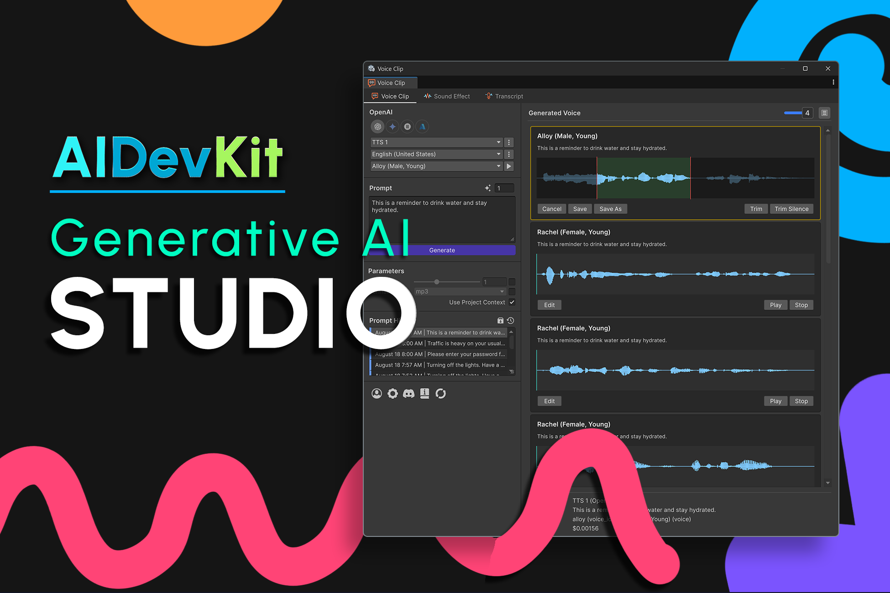

# AI Pixel Studio

<figure><figcaption></figcaption></figure>


**Coming soon.** AI Pixel Studio is currently in development and has not been released yet. Features
and API names on this page are previews and may change before launch.


Pixel art creation is tedious: character sprites need multiple angles, animations require
frame-by-frame work, and tileset assembly demands precise alignment. **AI Pixel Studio** delivers
production-ready pixel art generation and workflow automation, powered by AI DevKit — so you can make
game-ready sprites, animations, and tilesets in Unity without manual pixel-pushing or external tools.

## Planned features

* **Dedicated pixel art providers** — PixelLab (primary) and RetroDiffusion (style-based).
* **Text-to-pixel-art generation** — with style and size controls.
* **Sprite animation** — text-driven or skeleton-based, with sprite-sheet output and Unity 2D
  Animation integration.
* **Multi-angle rotation & tilesets** — generate consistent views (top-down, side, isometric) and
  coherent tilesets.
* **AI skeleton estimation** — auto-generate rigging skeletons from sprite images for Unity 2D
  Animation.
* **Editor tools** — style manager, palette importer, background remover, and Sprite Editor
  extensions.
* **Unified fluent API** — `GENPixelArt`, `GENPixelInpaint`, `GENPixelRotation`, `GENPixelAnimation`.

## What you'll be able to build

* Character sprites with automatic multi-angle views
* Frame-by-frame animations driven by text prompts or skeleton poses
* Game tilesets (platforms, terrain, environment) with a coherent style
* Sprite editing workflows (recolor, modify, extend existing pixel art)
* 2D rigged characters with AI-estimated bone structures
* Runtime procedural sprite generation for roguelikes and dynamic content

## Planned requirements

* AI DevKit base package (Lite or higher)
* Unity 6 (6000.x)
* Unity packages: 2D Sprite, 2D Animation, Animation Rigging

## Stay updated

<!-- TODO: add the AI Pixel Studio teaser / documentation / Discord link once available -->

Check back here, or join the community, for release news and pre-release builds.
