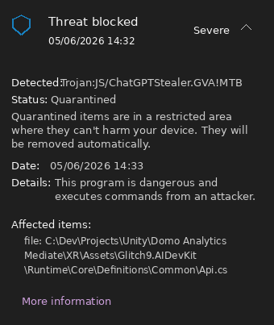

# Windows Security blocks or quarantines AI Dev Kit files

### **Issue**


Windows Security may show a **Threat blocked** warning and quarantine one or more files inside your Unity project, such as:

```
Detected: Trojan:JS/ChatGPTStealer.GVA!MTB
Affected item: Assets/Glitch9/AIDevKit/Runtime/Core/Definitions/Common/Api.cs
```

After this happens, Unity may report missing script files, compiler errors, or AI Dev Kit may stop working correctly.


<figure><figcaption></figcaption></figure>

### **Possible Cause**


This can happen when Microsoft Defender incorrectly flags a file inside the Unity project folder and moves it to quarantine. Once the file is quarantined, Unity can no longer compile the package normally.


### **How to Fix**


Add your Unity project folder to the Windows Security exclusion list.

1. Close Unity.
2. Open **Windows Security**.
3. Go to **Virus & threat protection**.
4. Under **Virus & threat protection settings**, click **Manage settings**.
5. Scroll down to **Exclusions** and click **Add or remove exclusions**.
6. Click **Add an exclusion** and choose **Folder**.
7. Select your Unity project folder, the folder that contains `Assets`, `Packages`, and `ProjectSettings`.
8. Reopen Unity.


### **If Files Were Already Quarantined**


After adding the project folder exclusion, restore the quarantined file from **Windows Security > Protection history**, or re-import **AI Dev Kit** so the missing files are restored.



Only add exclusions for Unity projects and packages you trust. Do not add broad exclusions such as your entire drive or Downloads folder.



If the issue persists even with the latest version, consider joining [Discord](https://discord.gg/hgajxPpJYf) where I provide **preview builds**, **hotfixes**, and direct support.

**Gain Access to the Agent preview builds channel.**\
To gain access, please send me your **proof of purchase** (e.g. invoice or order number).

