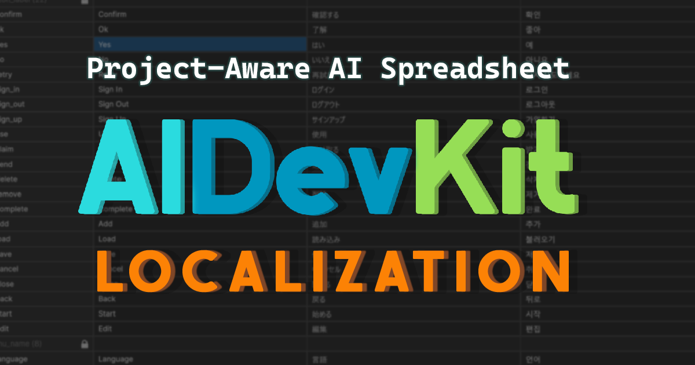

# AI Sheets

<figure><figcaption></figcaption></figure>

**AI Sheets** brings a full spreadsheet editor into Unity and combines it with AI to automate content generation, translation, and data management — without leaving the editor.

It is built around one engine (**Table → Column → Row → Cell**) that powers two workflows:

* **Database** — model your game data (items, skills, quests, dialogue, stats…) as typed tables, generate C# model classes from them, and load/query the data at runtime.
* **Localization** — localize the text your data and UI display: multi-language string tables, AI/Google/Microsoft translation, and drop-in components that update when the locale changes.

The two connect: a **Database cell can reference a Localization key** (Cross-Reference), so a single item row drives its localized display name without duplicating strings.

On top of both, an **AI layer** generates rows and cells from prompts, fills missing translations, and runs a **Spreadsheet Agent** that edits your sheets from natural-language tasks.

## What you can build

* Item / skill / quest / dialogue databases driven by typed tables
* Procedural content tables filled by AI
* Localization pipelines with AI-assisted translation
* Data validation and QA workflows
* Runtime data + localization with the included APIs and components

## Key features

* **Spreadsheet editor** — typed columns, multi-select, import/export (CSV, JSON), and two-way Google Sheets sync.
* **Database workflow** — generate C# model classes from tables and query data at runtime.
* **Localization workflow** — culture-code string tables, cross-references, and runtime `Tr` API + Unity components that react to locale changes.
* **AI content generation** — fill rows and cells from prompts, including reference/style images per column for asset generation.
* **Spreadsheet Agent** — describe a task in natural language and let the agent edit the sheet (create rows, translate, fill gaps).

## Requirements

* Unity 6 (6000.x)
* [UniTask](https://github.com/Cysharp/UniTask)
* [Newtonsoft.Json](https://docs.unity3d.com/Packages/com.unity.nuget.newtonsoft-json@latest)
* Addressables — optional, recommended for localized asset loading

## Links




